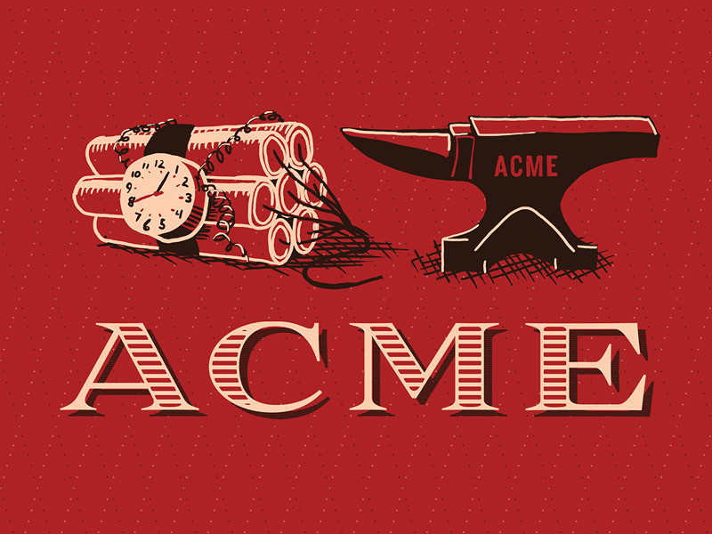

# Tema 6 - Práctica final 

Poner en práctica lo aprendido sobre CI/CD durante las clases mediante un ejemplo “real”.

## Práctica - ACME Corporation

Se nos ha contratado recientemente en la empresa ACME Corporation en el departamento de desarrollo para darle un impulso a la calidad de los productos de software de la empresa, así como acelerar el ritmo de entregables.

Todo viene motivado porque el principal cliente de ACME Corporation, Wile E. Coyote, se ha quejado reiteradas veces sobre la cuestionable calidad de la tienda online donde compra los productos de la empresa, y que le se está planteando seriamente cambiarse a la competencia, RoadRunner Corporation. La promesa de ACME Corporation es que va a realizar un esfuerzo importante en automatización del testeo y la entrega de software, y para ello nos ha incluido en su equipo de ingeniería.

El principal problema de ACME Corporation con su tienda online es que todas las partes son manuales, desde el desarrollo hasta el despliegue en producción, y no tiene tests. Al ser la arquitectura muy simple (un _Front-End_, un _Back-End_ y una base de datos) decidieron en su momento que no hacía falta automatización, pero al crecer en funcionalidades y número de desarrolladores han perdido el control de los despliegues, qué cambios llegan a producción y cuándo, etc. Aquí es donde se nos pide que apliquemos nuestra **magia**.

## Objetivo

Para los componentes de _Front-End_ y _Back-End_ (ignoraremos base de datos por el momento) necesitaremos crear dos pipelines:

*   **_Integración continua_** (CI)
    *   Testear cada _merge request_ contra _master_
    *   Testear y generar un entregable por cada _commit_ a _master_
*   **_Despliegue continuo_** (CD)
    *   Desplegar un entregable dado en un entorno dado

Además de los pipelines anteriores, y dado que queremos asegurarnos que cada entregable (ya sea _Front-End_ o _Back-End_) se integra correctamente con el resto de componentes previo despliegue a producción, desarrollaremos el siguiente pipeline:

*   **_Entrega continua_**
    *   Desplegar cada nuevo entregable en el entorno de _staging_ o _qa_
    *   Validar dich entorno con los tests de integración
    *   Si los tests fueron satisfactorios, desplegar el entregable en el entorno de _producción_

### Consideraciones

*   Debemos reportar el estado de la ejecución al _merge request_ y al commit en _master_
*   Debemos reportar los resultados de los tests
*   Si un despliegue falla, sería interesante que se restaurase la versión anterior
*   Si los tests de integración fallan, sería interesante que se restaurase la versión anterior
*   Cada entregable tendrá una versión semántica, ya sea calculada manualmente a partir de un fichero de configuración, o automática por el _pipeline_
*   Cada _pipeline_ debe notificar al desarrollador por algún medio (correo, slack, etc).
*   Por cada nuevo entregable que se genere (ya sea de _Front-End_ o _Back-End_) se ejecutará el _pipeline_ de entrega continua.

### Extra (no obligatoria)

Se puede gestionar los cambios en base de datos como otro componente más, con su integración, despliegue y entrega continua.

## Herramientas

Se le da la flexibilidad al alumn@ que elija las herramientas que más se
adapten a sus conocimientos y/o pretensiones:

 * CICD: Jenkins, GitlabCI, Travis, etc
 * Artefactos: S3, Nexus, etc
 * SCV: Github, Gitlab, Bitbucket, etc

Los tres componentes se basan en contenedores, por lo que el despliegue será siempre en algún entorno dockerizado (docker swarm, docker-compose, kubernetes, etc). Se deja a elección del alumn@ la implementación del despliegue (script, docker-compose.yaml, helm, etc).

La infraestructura mínima para la ejecución de la práctica que se ofrece inicialmente se basa en *Jenkins* (CI/CD, servidor de artefactos), y *docker-compose* para la ejecución de los componentes, pero como se ha dicho anteriormente se aceptan otras alternativas en el que el alumno se encuentre más cómodo (GitLab CI, Nexus, Artifactory, Kubernetes, Docker Swarm, etc). Los códigos y tests de los diferentes componentes pueden ser encontrados en [https://gitlab.keepcoding.io/keepcoding-bootcamps/full-stack-devops-bootcamp-ii/ciclo-de-vida-de-un-desarrollo-ci-cd/practica-final](https://gitlab.keepcoding.io/keepcoding-bootcamps/full-stack-devops-bootcamp-ii/ciclo-de-vida-de-un-desarrollo-ci-cd/practica-final), así como las instrucciones necesarias para inicializar la infraestructura inicial.

Encontrarán más información en los README.md de cada componente:

 * *backend*: API REST en flask
 * *frontend*: sitio web con nodejs
 * *data*: configuración de la base de datos
 * *integration*: test de integración para frontend, backend y datos
 * *infrastructure*: código para desplegar la infrastructura necesaria

## Evaluación

Se compartirá con el tutor el repositorio con los pipelines para verificar que:

1. Sintácticamente están correctos
2. Verificar que funcionan tanto a nivel de componente (merge request, generar entregable desde master) como a nivel de entrega continua.

## Sobre ACME Corporation

[https://magnet.xataka.com/nuestro-tsundoku/la-importancia-de-llamarse-acme-corporation](https://magnet.xataka.com/nuestro-tsundoku/la-importancia-de-llamarse-acme-corporation)
