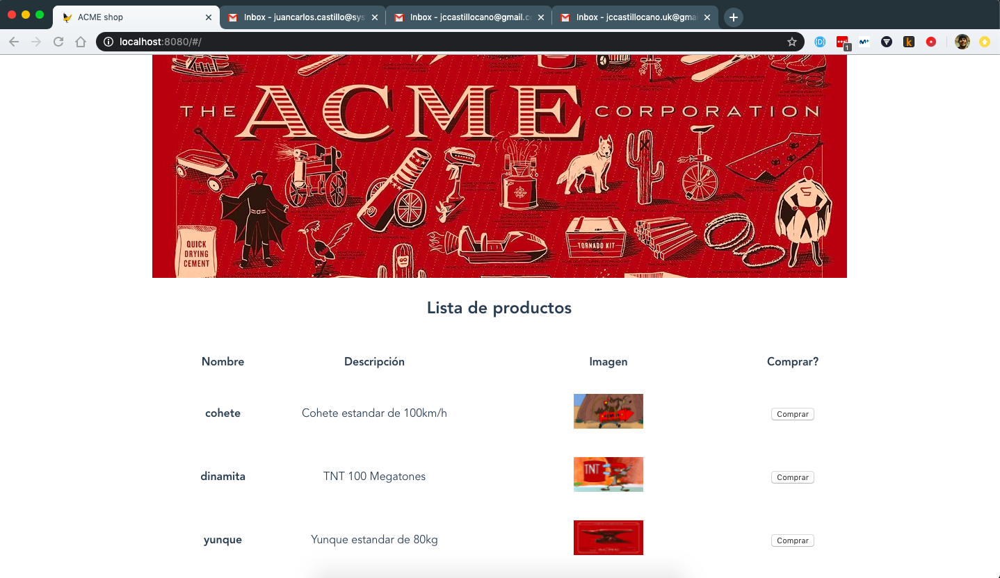

# Test de integración

Para poder testear correctamente la integración entre los diferentes componentes, usaremos [docker-compose](https://docs.docker.com/compose/) que nos permite desplegar todos los componentes en un único despliegue, y [behave](https://behave.readthedocs.io/en/latest/index.html) para los tests de comportamiento.

## Iniciar los componentes

Para simplificar la ejecución de los tres stacks, los lanzaremos con `docker-compose up -d`. Este comando creará las imágenes si no existen de cada uno de los directorios (_backend_, _frontend_ y _data_), las redes necesarias y los conectará (_frontend_ con _backend_, y _backend_ con _data_). Los puertos quedan accesibles de la siguiente manera:

 * 8080: Acceso a la web (tienda online)
 * 3307: puerto de la base de datos MySQL

Para acceder a los logs de los componentes usaremos el comando `docker-compose logs -f` que irá mostrando los logs en orden de aparición.



## Ejecutar los tests

Los tests de comportamiento están escritos en lenguaje natural con _behave_ en Python (ver las diferentes *features* dentro del directorio _features_).

### Requerimientos

 - [ChromeDriver](https://chromedriver.chromium.org/) para la parte visual en Google Chrome
 - [virtualenv](https://docs.python-guide.org/dev/virtualenvs/#lower-level-virtualenv) para las dependencias de _behave_.
 
Inicializaremos un _virtualenv_ e instalaremos las dependencias de python de la siguiente manera:

``` bash
virtualenv .env -p python3.7
. .env/bin/activate
pip install -r requirements.txt
```

## Ejecución de los tests

Lanzaremos los tests de la siguiente manera:

``` bash
behave
```

veremos una salida de logs en la consola parecida a

``` bash
Feature: shopping ACME stuff # features/shopping.feature:1

  Background: go to main site  # features/shopping.feature:3

  Scenario: count number of items  # features/shopping.feature:6
    Given We are in the main site  # features/steps/shopping.py:6 0.382s
    Then 3 items must be displayed # features/steps/shopping.py:11 0.052s

  Scenario Outline: list current items -- @1.1 Items  # features/shopping.feature:14
    Given We are in the main site                     # features/steps/shopping.py:6 0.093s
    Then "cohete" item must be displayed              # features/steps/shopping.py:17 0.058s

  Scenario Outline: list current items -- @1.2 Items  # features/shopping.feature:15
    Given We are in the main site                     # features/steps/shopping.py:6 0.057s
    Then "dinamita" item must be displayed            # features/steps/shopping.py:17 0.095s

  Scenario Outline: list current items -- @1.3 Items  # features/shopping.feature:16
    Given We are in the main site                     # features/steps/shopping.py:6 0.059s
    Then "yunque" item must be displayed              # features/steps/shopping.py:17 0.126s

  Scenario: shop item                                          # features/shopping.feature:18
    Given We are in the main site                              # features/steps/shopping.py:6 0.077s
    Then We want to buy a "cohete" with "coyote@acme.es" email # features/steps/shopping.py:23 2.952s

1 feature passed, 0 failed, 0 skipped
5 scenarios passed, 0 failed, 0 skipped
10 steps passed, 0 failed, 0 skipped, 0 undefined
Took 0m3.952s
```

Si queremos generar reportes en formato junit, simplemente cambiaremos el comando por `behave --junit`, lo que nos generará el fichero _reports/TESTS-shopping.xml_ con los resultados de los tests.

## Finalizar la ejecución

Para no dejar contenedores ejecutándose, pararemos los componentes y borraremos las imágenes generadas para evitar conflictos futuros con los siguientes comandos:

``` bash
docker-compose stop
docker-compose rm -f
```
